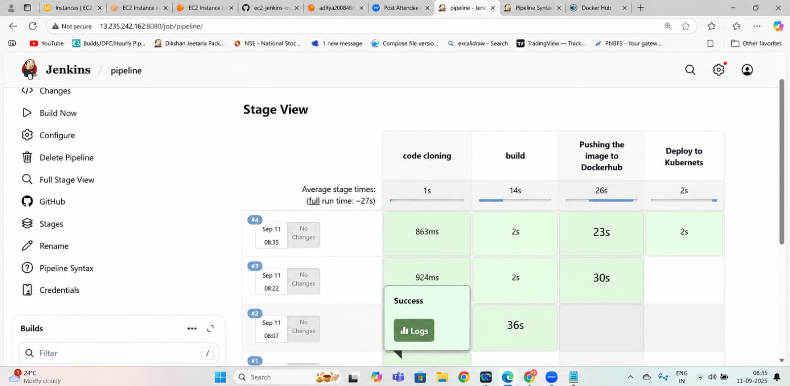

# Django Notes App — DevOps Practice Project

## 📌 About
Deployed a React + Django Notes App as a DevOps 
practice project on AWS EC2 using Docker and Nginx.

## 🔧 What I Did
- Cloned and containerized the app using Docker
- Deployed on AWS EC2 instance
- Configured Nginx as reverse proxy
- App accessible via public IP on port 8000

## 📸 Screenshots

### Jenkins Pipeline

### Kubectl Deployment

## 🛠️ Tech Stack
- Frontend: React
- Backend: Django (Python)
- Container: Docker
- Server: Nginx
- Cloud: AWS EC2
